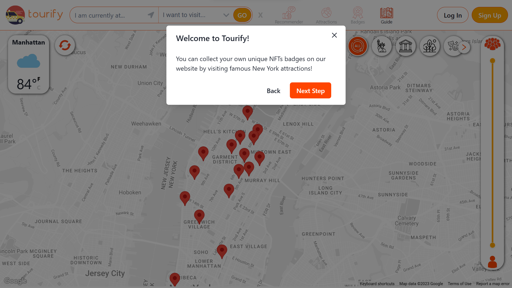
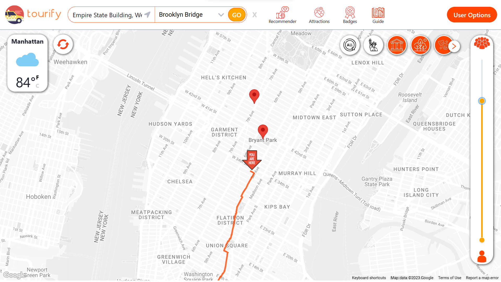

# Tourify
  
Temporarily hosted on UCD servers: https://csi6220-2-vm1.ucd.ie/

## Abstract

Immerse yourself in Manhattan with Tourify! Tourify integrates React's interactivity, Spring Boot's robustness, and modern Machine Learning tools for an all-in-one solution. Tourify offers real-time route planning, geolocation check-ins at attractions, and uniquely minted NFTs to commemorate your visits. Our Artificial Intelligence model empowers you to make smart travel decisions by calculating the crowd density at prime attractions throughout Manhattan — even into the future!

Uniting tech and user-centric design, Tourify elevates your journey, redefining urban exploration. Built for scalability, its modern architecture can enhance travel worldwide.

---
Delve into the backend specifics on our [repository's Wiki page](https://github.com/ddrangers/Tourify-Backend/wiki).

For a comprehensive overview of the entire project, including frontend and machine learning components, visit the main [Tourify repository](https://github.com/ajwadjaved/Tourify).

🎥 Get a visual walkthrough with our [video introduction](www.example).

📄 Grab the detailed backend academic report [here](https://drive.google.com/file/d/1wj3F0XTr-o5il59UX4iwGROH57-BnBPY/view?usp=sharing).

## Backend

As the leader of the backend development for this project, I've designed and implemented a robust backend service using Java and Spring Boot. The service is enhanced with Spring Security and MongoDB, delivering a scalable and secure Open API server. The backend provides Api for common CRUD operations for the important entities for the website and the user authentication & authorization process.

During the development, several industry-standard design patterns were employed including the implementation of the Spring Model-View-Controller (MVC) pattern, Global Unified Exception Handling, and Uniform Response Wrapper Result. Tools such as Maven were utilized for package management, Docker for containerization, Postman for API testing, and Swagger for API documentation.

## Website Overview

### Features
* Creating user accounts using Google OAuth
* Real-time busyness predictions for our curated list of attractions in Manhattan
* Route Planning for users to get real-time directions
* Geo-location based Check-ins at tourist attractions
* Rewards for Check-ins that include Badges and a unique minted NFTs sent to their wallet address
* Real-time weather display updates in Manhattan
* A recommender for users to see the nearest and least busy attractions
* Ability to change the users NFT wallet address
* Ability to delete their accounts and all user data hosted on our servers
* Ability to provide user feedback to be fed back into the Machine Learning model to improve the predictions
* A helping starting guide with attached screenshots for how to use each feature on the application

**Welcome Screen**

  
**User Interface**
  

## Frontend

Our frontend is beautifully crafted with React and Chakra UI, presenting a contemporary and user-friendly interface. Please note, as this repository is a fork, you can explore more details about the frontend development in the original repository!

## Datasets

To power our application, we've harnessed an array of data, including:

* [Yellow Taxi data from NYC Taxi and Limousine Commission Trip Record Data](https://www.nyc.gov/site/tlc/about/tlc-trip-record-data.page)
* [Subway Hourly Ridership from Metropolitan Transportation Authority](https://data.ny.gov/Transportation/MTA-Subway-Hourly-Ridership-Beginning-February-2022/ekwu-khcy)
* [Foot Traffic Data from BestTime.app](https://besttime.app/)
* [Weather Data from Open Weather](https://openweathermap.org/current)
* [Weather Data from Weather Underground](https://www.wunderground.com/history/daily/us/ny/new-york-city/KLGA)
* [Top Attractions within Manhattan](https://www.timeout.com/newyork/attractions/new-york-attractions)

In addition, we've curated two datasets from scratch. The first encompasses a comprehensive list of attractions, while the second details subway locations connecting these attractions.

---

Please note that visit the main repository for comprehensive data analytics and front details.

Enjoy your exploration with Tourify, your personalized guide to Manhattan!

#### Contact
  
This project was made for the UCD COMP47360 summer project. For any questions feel free to get in touch with any of the collaborators.
